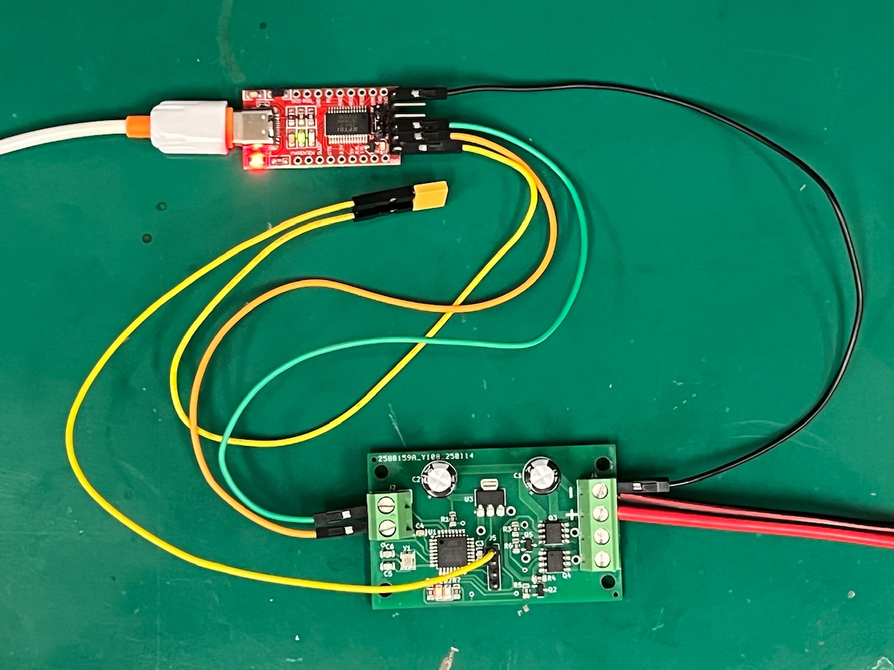
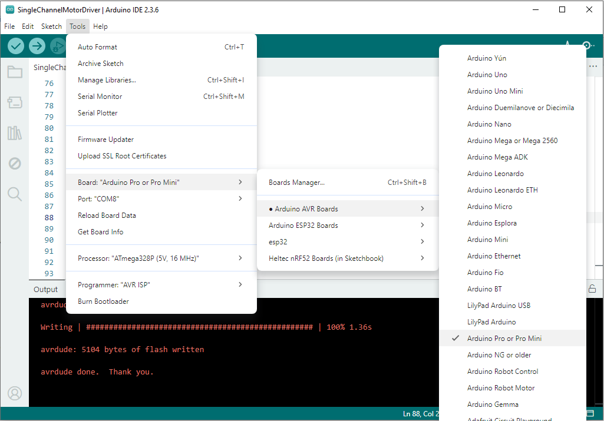

# Programming the Single Channel Motor Driver Using Arduino IDE and USB FTDI Breakout Board

This guide explains how to program the single channel motor driver using the **Arduino IDE** and a **USB-to-FTDI (FT232RL) breakout board**. The board will need to be powered with 12V via **J4-1 (- GND)** and **J4-2 (+ 12V)**.

---

## 🔧 What You Need

- Single Channel Motor Driver
- **USB-to-UART** breakout board with 5V logic (e.g., FTDI Basic, FT232RL)
- **Jumper wires** female-to-male
- **0.1uF capacitor** for the reset circuit
- **Arduino IDE** installed on your computer
- **Code** Downloaded from this repository
---

## 🛠️ Wiring Instructions

Connect your **FTDI breakout board** to the ATmega328P target board as follows:

| USB-UART Pin | Connects To                  |
|--------------|------------------------------|
| TXD          | J2-1                         |
| RXD          | J2-2                         |
| GND          | B- (GND)                     |
| DTR (or RTS) | capacitor(-)                 |
| capacitor(+) | J5-1                         |

> ⚠️ **Important:** Do **not** connect the FTDI VCC or 5V pin. Your board is already powered via 12V.
> The capacitor is wired in series between the DRS/RTS pin on the USB-UART and J5-1. This ensures the reset is handled correctly

---

## 💻 Arduino IDE Setup

1. **Open the Arduino IDE**
2. Go to **Tools > Board** and select:
   - `Arduino Mini or Pro Mini`
     
3. Go to **Tools > Port** and choose the COM port assigned to your FTDI adapter
4. Open the sketch
5. Click **Upload**

> The **DTR** pin triggers a reset automatically before uploading the sketch.

---

## ✅ Troubleshooting

- **No response?** Double-check TX and RX aren’t swapped:
  - USB-UART **TX → J2-1**
  - USB-UART **RX → J2-2**
    Double check the power, there should be 12V between J4-1 and J4-2, There should also be 5V on the tab of U3.
- **No COM port showing?** Replug the USB-UART or check driver installation.
- **Upload error?** Ensure the bootloader is present and the chip isn’t stuck in reset.

---

